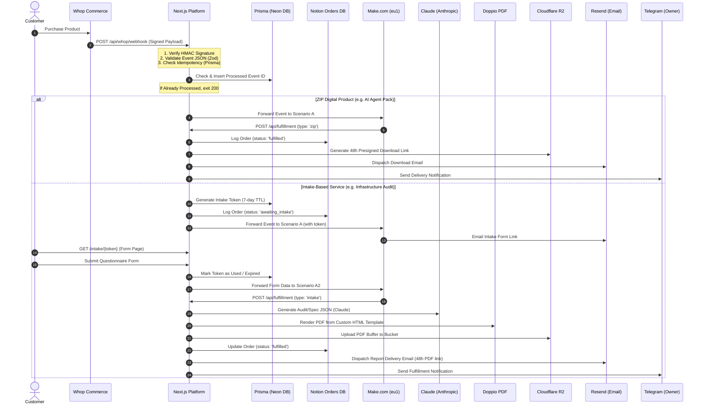

# System Architecture

The TechSci Agency Platform is designed to operate fully autonomously. It functions as a secure integration middleware bridge connecting commerce channels (Whop), backend database engines (Prisma on Neon), operations tracking boards (Notion), AI models (Claude Sonnet), PDF generation microservices (Doppio), object storage (Cloudflare R2), and notification dispatches (Resend & Telegram).

---

## 🛠️ Pipeline Flow Diagram



---

## 🌐 API Route Specifications

All internal fulfillment and utility endpoints are guarded by a shared secure credential token key passed via the `x-internal-api-key` header.

| Endpoint | Method | Authentication | Purpose |
| :--- | :--- | :--- | :--- |
| `/api/whop/webhook` | `POST` | Whop HMAC Header | Primary webhook listener for Whop memberships and payment events. |
| `/api/intake/submit` | `POST` | None (Token Validated) | Receives customer intake form submissions, marks the token as used, and forwards payloads. |
| `/api/intake/create` | `POST` | `x-internal-api-key` | Programmatic creation of custom intake tokens (for manual overrides). |
| `/api/fulfillment` | `POST` | `x-internal-api-key` | Core fulfillment engine orchestrating Claude, Doppio, R2, Notion, and email dispatches. |
| `/api/r2/presign` | `POST` | `x-internal-api-key` | Generates 48-hour secure pre-signed download URLs for specific R2 object keys. |
| `/api/campaign/trigger` | `POST` | User Session (Admin Only) | Server action gateway triggering Make.com Scenario F campaigns. |
| `/api/health` | `GET` | None | System status and database latency checker. |
```
