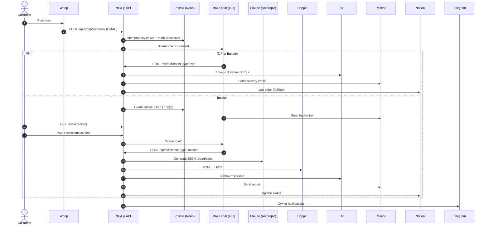

# System Architecture

Autonomous Agency Platform runs two surfaces: public marketing site + fulfillment backend. All orchestration happens in Make.com, storage in R2, ops tracking in Notion.

---

## Public marketing site

Static App Router pages (Server Components by default):

- `/` landing
- `/products` catalog (client filter)
- `/products/[slug]` product detail (SSG)
- `/pricing`, `/about`, `/legal/privacy`, `/legal/terms`
- `robots.txt` + `sitemap.xml`

Catalog source of truth: `lib/marketing/products.ts`.

---

## Fulfillment flow (Whop → Make → AI → R2 → Email)

---

## API routes

| Endpoint | Method | Auth | Purpose |
| --- | --- | --- | --- |
| `/api/whop/webhook` | POST | Whop HMAC | Primary webhook entry |
| `/api/intake/submit` | POST | Token validated | Intake form submission |
| `/api/intake/create` | POST | `x-internal-api-key` | Internal token creation |
| `/api/fulfillment` | POST | `x-internal-api-key` | ZIP + intake fulfillment |
| `/api/r2/presign` | POST | `x-internal-api-key` | 48h download URL |
| `/api/campaign/trigger` | POST | `x-internal-api-key` | Make.com Scenario F |
| `/api/health` | GET | None | Liveness check |
